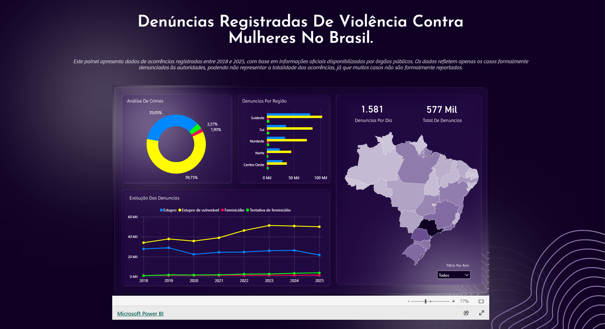

# Projeto Dashboard — Violência Contra Mulheres no Brasil

🔗 **Acesse o site:** https://rafaaps.github.io/ProjetoDashboard/

<br>

## Sobre o projeto

Este projeto é um painel web (dashboard) que apresenta dados sobre denúncias de violência contra mulheres registradas no Brasil entre 2018 e 2025, com base em informações oficiais disponibilizadas por órgãos públicos.

O objetivo é dar visibilidade ao problema por meio de dados, além de reunir informações sobre canais de apoio e denúncia (Disque 180, Disque 181 e Disque 100) para mulheres em situação de violência.

> ⚠️ Os dados refletem apenas os casos formalmente denunciados às autoridades e podem não representar a totalidade das ocorrências, já que muitos casos não são reportados.

<p align="center">
  
</p>

<br>

## 🛠️ Tecnologias utilizadas

- **HTML5**
- **CSS3** (`style.css` e `responsive.css` para responsividade)
- **JavaScript** (`script.js`)
- **Power BI Embedded** (visualização dos dashboards e gráficos)
  
<br>

## Como executar localmente

1. Clone o repositório:
   ```bash
   git clone https://github.com/RafaApS/ProjetoDashboard.git
   ```
2. Entre na pasta do projeto:
   ```bash
   cd ProjetoDashboard
   ```
3. Abra o arquivo `index.html` no navegador (ou use uma extensão como o Live Server, no VS Code).

<br>

<div align="center">
  <h3>Se você ou alguém que você conhece está passando por uma situação de violência, ligue gratuitamente e a qualquer horário para o <big>Disque 180</big>. Você não está sozinha. ❤️</h3>
</div>

<br>

## 📊 Fontes de dados

- [Ministério da Justiça e Segurança Pública – Dados Nacionais de Segurança Pública](https://www.gov.br/mj/pt-br/assuntos/sua-seguranca/seguranca-publica/estatistica/dados_nacionais_de_seguranca_publica)
- [Central de Atendimento à Mulher – Ligue 180](https://www.gov.br/mulheres/pt-br/ligue180)


